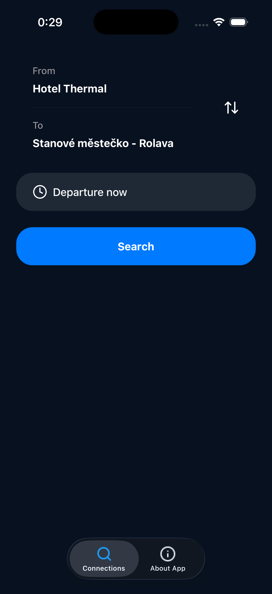
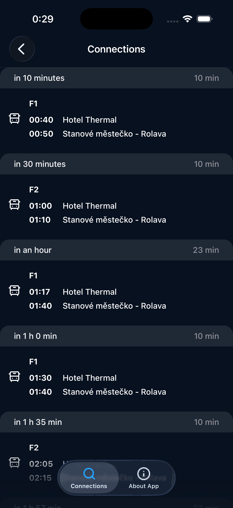
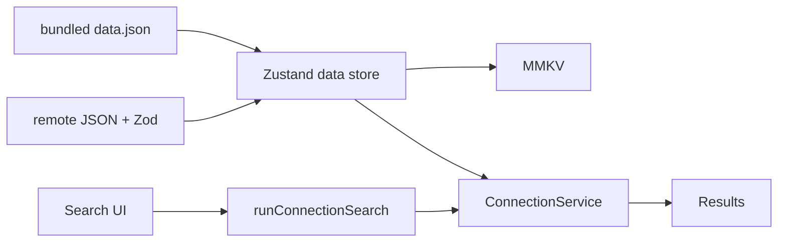

# KVIFF Bus

Unofficial offline-first finder for Karlovy Vary International Film Festival shuttle lines **F1, F2, F3**.

[](https://docs.expo.dev/versions/v57.0.0/)
[](https://www.typescriptlang.org/)
[](https://github.com/lpikora/kviffbus-expo/actions)
[](LICENSE)

The finder has been in use since **2022**. This repo is the current **native iOS and Android** app (Expo SDK 57). Timetables come from a remote feed (`data.json` / `version.json` on [kviffbus.cz](https://kviffbus.cz)). Fan-made — not affiliated with KVIFF.

<table>
  <tr>
    <td align="center"><strong>Search</strong></td>
    <td align="center"><strong>Results</strong></td>
  </tr>
  <tr>
    <td></td>
    <td></td>
  </tr>
</table>

## What it does

Pick two festival stops, choose **now** or a later departure, and get **direct** shuttle connections with line, times, duration, and a live “in X minutes” label. Transfers are out of scope.

The UI follows the device language (**Czech / English**). Last selected stops persist across launches.

## Where to look first

A 10-minute scan, in this order:

1. [`src/stores/data-store.ts`](src/stores/data-store.ts) + [`src/hooks/use-sync-data.ts`](src/hooks/use-sync-data.ts) — bundled seed → MMKV → versioned sync; splash/hydration; interval + `AppState`
2. [`src/types/dataSchema.ts`](src/types/dataSchema.ts) — Zod at the network boundary
3. [`src/services/connection-service.ts`](src/services/connection-service.ts) + [`src/actions/run-connection-search.ts`](src/actions/run-connection-search.ts) — pure search; screens do not match connections
4. [`src/components/date-time-picker/`](src/components/date-time-picker/) — iOS vs Android platform split
5. [`src/app/_layout.tsx`](src/app/_layout.tsx) — Router shell, `ErrorBoundary`, `NativeTabs`

## Highlights

- **Offline-first timetables.** Bundled [`assets/data/data.json`](assets/data/data.json) hydrates Zustand, persists to MMKV, then a background fetch applies only a newer `importVersion`.
- **Zod at the network boundary.** Remote JSON is `safeParse`d before it touches state.
- **Pure, tested search.** Binary search over sorted departures, date windows, stop exceptions, overnight arrivals.
- **Typed errors → i18n.** Zustand persist for timetable data and last stops; `AppError` codes are translation keys.

## Architecture

Screens do not fetch or search. Data sync lives in the store; connection matching lives in a service.



## Stack

Expo SDK 57 · React Native 0.86 · React 19 · Expo Router (typed routes) · Zustand + MMKV · Zod · i18next · Jest + React Native Testing Library · EAS · React Compiler (experimental)

## Run locally

Requires **Node.js 24+**. `react-native-mmkv` (Nitro) needs a **dev build** — not Expo Go.

```bash
npm install
npx expo start
```

- iOS: `npm run ios`
- Android: `npm run android`

```bash
npm run type-check
npm run lint
npm run test:ci
```

Preview binaries: `eas.json` profiles (`npx eas-cli@latest build --profile preview --platform android`).

## Quality

Unit tests cover the search engine, stores, sync hook, i18n key parity, and UI pieces. GitHub Actions runs type-check, lint, and `test:ci` on every push. Husky + lint-staged gate commits with ESLint, related Jest tests, and `tsc`.

## License

MIT © 2026 [Lukáš Pikora](https://github.com/lpikora)
